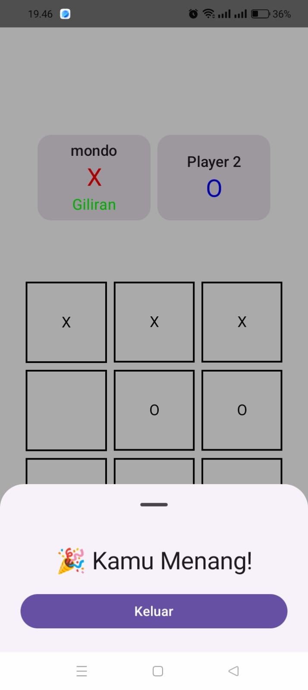

# 📱 TicTacToe

> **Aplikasi Android Game sederhana Menggunakan gRPC**

## ⬇️ Download & Demo
| Platform | Link Akses |
| :---: | :--- 
| **Android (APK)** | [**📥 Download APK Disini**](https://drive.google.com/file/d/1_XK2kLiJuwao0Fljxb7toAqid2WwAz8-/view?usp=drive_link) |

---

## 📸 Tampilan Aplikasi
Berikut adalah tampilan antarmuka aplikasi:

  
  &nbsp;&nbsp;&nbsp;&nbsp;
  

  
  &nbsp;&nbsp;&nbsp;&nbsp;
  

---

## 🛠️ Tech Stack

### 📱 Frontend
- Kotlin
- Jetpack Compose

### 🌐 Backend
- Node.js
- Express
- gRPC

### 🧪 Tools
- Android Studio
- BloomRPC

---

## 📌 Catatan
- Aplikasi ini dibuat untuk pembelajaran dan eksplorasi konsep gRPC
- UI dibuat sederhana dan fokus pada gameplay
- Aplikasi ini masuh versi v1.0.0 dalam pengembangan

---

## 📄 Lisensi
Digunakan untuk keperluan tugas kuliah dan pembelajaran.  
© 2025 TicTacToe Project
